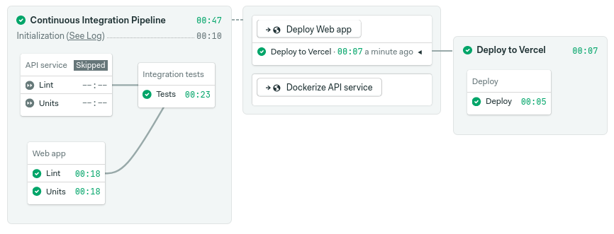

# JavaScript Monorepo Demo

[](https://semaphore-demos.semaphoreci.com/projects/semaphore-demo-monorepo-javascript)

This demo repository teaches you how to use [Yarn Workspaces](https://classic.yarnpkg.com/en/docs/workspaces/) and [Lerna](https://lerna.js.org/) to manage JavaScript [monorepos](https://semaphoreci.com/blog/what-is-monorepo). You’ll build a monorepo from two separate applications.

Check the `final` branch to see the end result.

## Contents

This repository contains two projects. Their folders are:

- `api`: An API that returns geographical information.
- `web`: A static website generated from the information returned by the API.

You can run each project independently or in combination. Check each folder to learn how to run them piecemeal. The next section shows how to run them together.

## Setup monorepo with Yarn workspaces

1. Fork this repo.
2. Clone it to your machine.
3. Download latest yarn version.
    ```bash
    $ yarn set version berry
    ```
4. Initialize top-level `package.json`.
    ```bash
    $ yarn init -w
    ```
5. Move projects to their workspaces.
    ```bash
    $ git mv api web packages
    $ yarn workspaces list
    ```
6. Install all modules.
    ```bash
    $ yarn install
    ```
7. Delete old `yarn.lock`
    ```bash
    $ git rm packages/api/yarn.lock packages/web/yarn.lock
    ```
7. Add the new files to the repository. This will also commit all dependencies.
    ```bash
    $ git add .yarnrc.yml .yarn yarn.lock .gitattributes .gitignore package.json .pnp.js
    $ git commit -m "finalize monorepo setup"
    $ git push
    ```
You can peek at the final state of the pipeline in the `final` branch.



## Run development version

```bash
$ yarn workspace api start &
$ yarn workspace web dev
```

### Run tests

```bash
# Linting
$ yarn workspace api lint
$ yarn workspace web test

# Unit tests - api
$ yarn workspace api start &
$ yarn workspace api test

# Unit tests - web
$ yarn workspace web test

# Integration tests
$ yarn workspace api start &
$ yarn workspace web build
$ yarn workspace web start &
$ yarn workspace web test-integration
```
### Add modules in one workspace

```bash
$ yarn workspace <workspace-name> add <package-name>
```
### Run scripts

```bash
$ yarn worksapce <workspace-name> run <script-name>
```
## Build static site

```bash
$ yarn workspace api start &
$ yarn workspace web build
$ yarn workspace web export
```

## Tips for Yarn

A note about Yarn Plug’n’play: scripts running from `Scripts` in `package.json` or with the `yarn run` command will work. But if you run a program directly as `node app.js` it will fail. Instead, run it like `yarn node app.js` this will initialize PnP.

If you’re using zero-installs and accepting PRs from untrusted sources, it’s a good idea to add a cache check job somewhere in your CI pipeline. This command will re-download all the modules and check them against the cache to ensure none of the dependencies were modified maliciously.

```bash
yarn install --check-cache
```

## Setup a monorepo with Lerna

To setup a monorepo with Lerna + NPM, first initialize the repository.

```bash
$ lerna init
$ lerna import api
$ lerna import web
```

Now Lerna should detect the monorepo.

```bash
$ lerna ls
api
web
found 2 packages
```

With `bootstrap`, Lerna downloads dependencies with NPM and links the packages.

```bash
$ lerna bootstrap
```

Run the tests for each package in the monorepo.

```bash
$ lerna exec npm run lint
$ lerna exec npm dev &
$ lerna exec npm test
$ lerna exec npm run test integration
```

Push the updates to the repository.

```bash
$ git add lerna.json package.json packages
$ git commit -m "install lerna, ready to publish"
```

Publish the new version to NPM. You need to be already-authenticated with `npm login`.

```bash
$ lerna version
$ lerna publish from-git
```

## Tips for coupling Lerna and Workspaces

Add the following lines to `lerna.json`.

```json
 "npmClient": "yarn",
 "useWorkspaces": true
```

## License

MIT License

Copyright (c) 2021 Rendered Text

Permission is hereby granted, free of charge, to any person obtaining a copy of this software and associated documentation files (the "Software"), to deal in the Software without restriction, including without limitation the rights to use, copy, modify, merge, publish, distribute, sublicense, and/or sell copies of the Software, and to permit persons to whom the Software is furnished to do so, subject to the following conditions:

The above copyright notice and this permission notice shall be included in all copies or substantial portions of the Software.

THE SOFTWARE IS PROVIDED "AS IS", WITHOUT WARRANTY OF ANY KIND, EXPRESS OR IMPLIED, INCLUDING BUT NOT LIMITED TO THE WARRANTIES OF MERCHANTABILITY, FITNESS FOR A PARTICULAR PURPOSE AND NONINFRINGEMENT. IN NO EVENT SHALL THE AUTHORS OR COPYRIGHT HOLDERS BE LIABLE FOR ANY CLAIM, DAMAGES OR OTHER LIABILITY, WHETHER IN AN ACTION OF CONTRACT, TORT OR OTHERWISE, ARISING FROM, OUT OF OR IN CONNECTION WITH THE SOFTWARE OR THE USE OR OTHER DEALINGS IN THE SOFTWARE.
